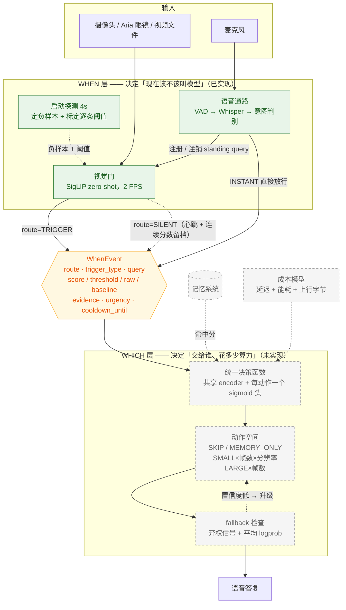
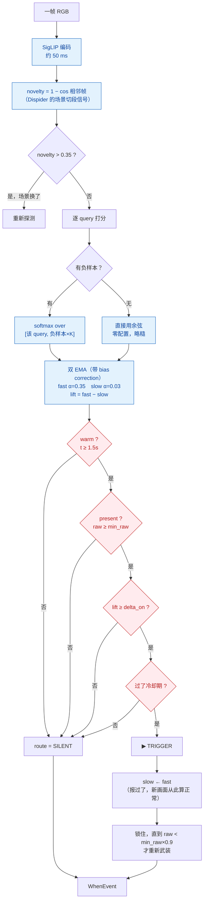
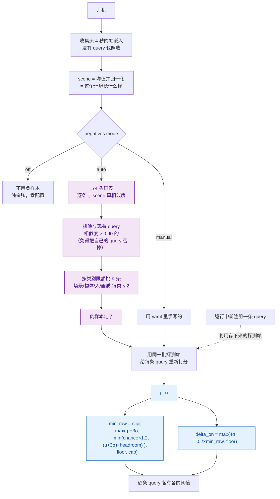
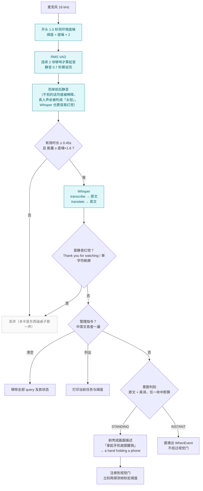

# 架构图

四张 Mermaid 图。把代码块里的内容粘进 [mermaid.live](https://mermaid.live) 或
MermaidEditor.io 即可渲染。

**实线 = 已实现，虚线框 = 未实现。**

---

## 1. 总览：WHEN 与 WHICH 的分工



WHEN 的职责边界：**只回答「该不该叫」，不回答「发生了什么」**。
分辨「拿起眼镜」还是「戴上眼镜」是 WHICH 的活——它那边才有真正能理解画面的大模型。

---

## 2. 视觉门：每一帧的判定链路



**两个条件缺一不可**：

| 条件 | 回答什么 | 少了它会怎样 |
|---|---|---|
| `lift ≥ delta_on` | 刚刚**变了**没 | 只看 raw：物体一直在画面里就会一直报 |
| `raw ≥ min_raw` | 东西**真在**画面里没 | 只看 lift：基线低的 query 被任何画面变动带着一起触发 |

---

## 3. 启动探测：负样本从哪来、阈值怎么定



**为什么阈值必须逐条标定**：不同 query 在同一场景下的分数量纲能差 4 倍以上；
全局一个阈值会让后注册的 query 永远够不到。

**为什么 chance 锚点要加天花板**：`1.2/(1+K)` 是固定值，而分数量纲随负样本贴合度
差一个数量级——负样本越像这个场景，query 抢到的 softmax 概率越低。厨房场景实测
所有 query 峰值只有 0.017–0.094，固定的 0.171 是谁都翻不过的墙。

---

## 4. 语音通路



**说中文、query 用英文**：SigLIP 的文本塔是英文训练的，中文描述匹配不上。
Whisper 自带 `translate` 任务，任何语言进、英文出。注意 `large-v3-turbo`
**不支持翻译**，喂它 `task="translate"` 会原样返回中文。

---

## WHEN → WHICH 的契约

`route=SILENT` 的事件也会输出——既是心跳，也保留连续分数供后续标定阈值。

```json
{
  "seq": 106,
  "t_emit": 11.501,
  "route": "TRIGGER",
  "trigger_type": "STANDING",
  "query": {"text": "a water bottle placed close to a keyboard",
            "origin": "user_standing", "query_id": "sq_bottle"},
  "score": 0.1029, "threshold": 0.1,
  "raw_score": 0.7715, "baseline": 0.6017,
  "evidence": {"window": [9.501, 11.501],
               "frame_idx": [19, 20, 21, 22, 23],
               "novelty": 0.1698},
  "urgency": "normal",
  "cooldown_until": 16.501
}
```

| 字段 | WHICH 拿它做什么 |
|---|---|
| `trigger_type` | INSTANT 走正常模型选择；ALERT 延迟预算更紧 |
| `query.text` | 决策函数的 query 嵌入输入 |
| `evidence.frame_idx` | **HOW MUCH 的直接输入**——送几帧下去 |
| `score` / `raw_score` / `baseline` | 门有多确信，可作为升级信号 |
| `urgency` | 延迟预算 |
| `novelty` | 画面变化量，可作为额外特征 |

---

## 现状

| | 状态 |
|---|---|
| WHEN 视觉门 | 已实现，零训练 |
| WHEN 语音通路 | 已实现 |
| WHEN 探测与标定 | 已实现 |
| **WHICH 全部** | **未实现**——上图中的设计来自架构讨论，尚未落地 |
| 记忆系统接口 | 未实现，`WhenEvent` 里已预留位置 |

WHEN 的已知弱项见 [CHANGELOG.md](CHANGELOG.md) 的 TODO：跨场景的分数量纲差一个
数量级，阈值公式目前靠三个约束拼出来，`auto` 仍略逊于 `manual`。
