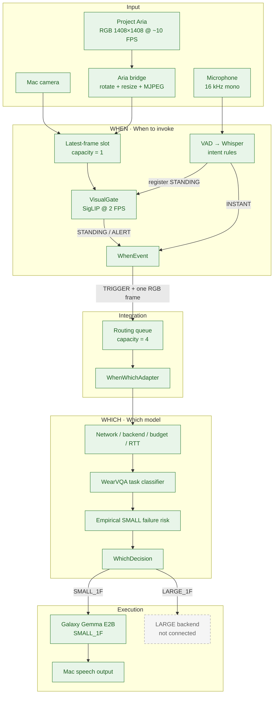
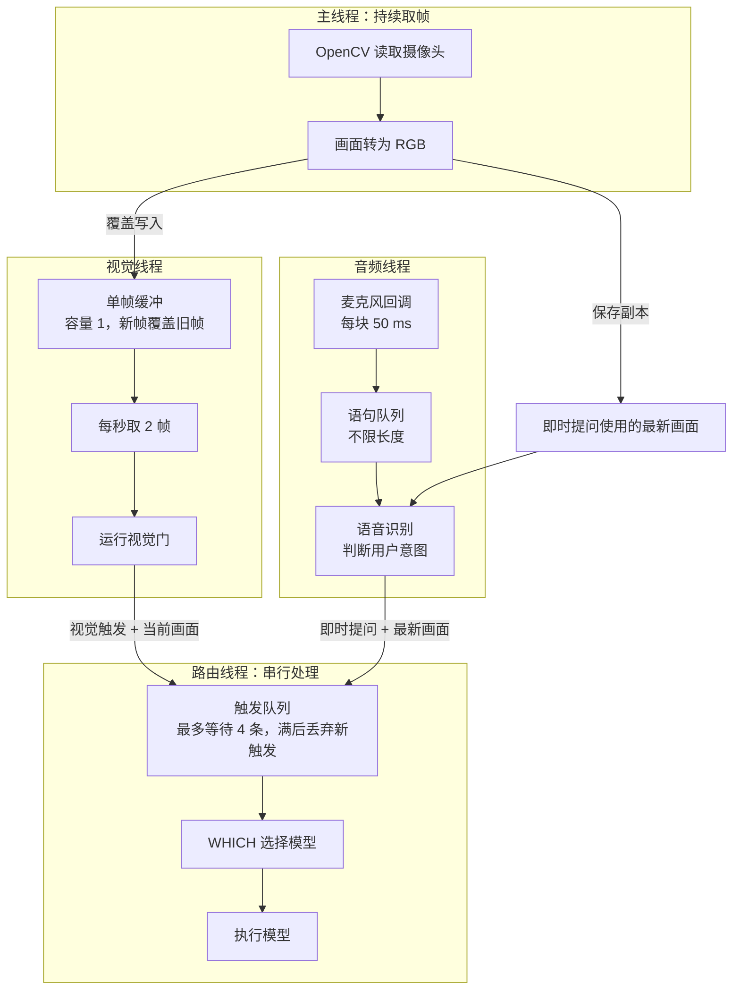
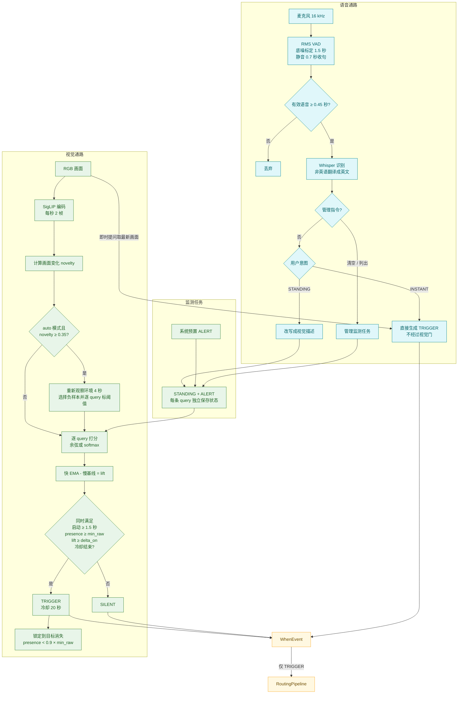
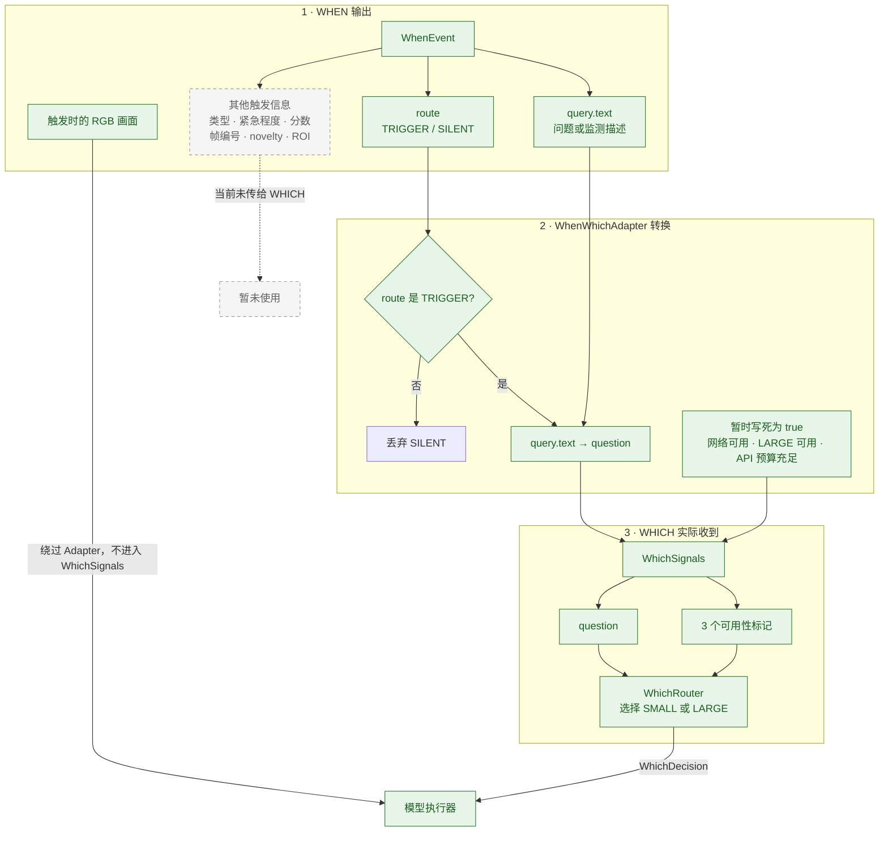
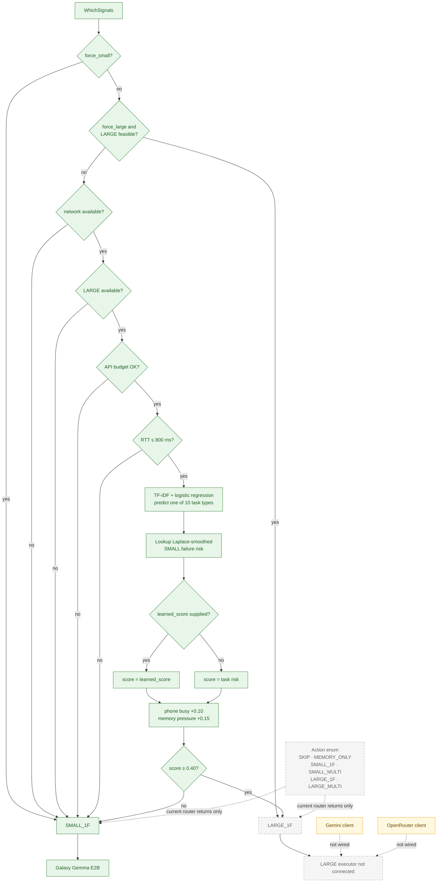

# Smart AI Glasses Routing Architecture

基于 `zhuoyingyang-routing-full-pipeline@196db67`。

绿色为已接通，黄色为已有代码但未接入在线链路，灰色虚线为接口占位。

## 1. Full pipeline

## 2. 运行时线程与数据流

## 3. WHEN：语音注册、视觉监测与触发

## 4. WHEN 如何把触发交给 WHICH

## 5. WHICH policy and action space

